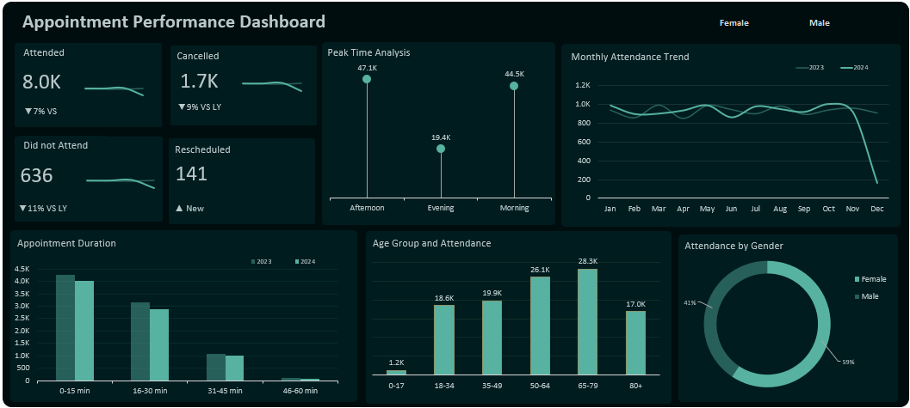

# Appointment Performance Dashboard

## Background and Overview

Efficient appointment management is critical to healthcare operations. Missed appointments, cancellations, and scheduling inefficiencies can reduce resource utilization, increase operational costs, and negatively impact patient care outcomes.

This project analyzes healthcare appointment data to evaluate attendance patterns, patient demographics, scheduling efficiency, and year-over-year performance trends. The objective is to provide stakeholders with a comprehensive view of appointment performance while identifying opportunities to improve attendance rates, optimize scheduling, and enhance operational efficiency.

Using Microsoft Excel and Power Query, the dataset was transformed, enriched, and visualized through an interactive dashboard. Additional feature engineering was performed to create meaningful age-group segments and appointment duration categories, enabling deeper analysis of patient behavior and appointment patterns.

The resulting dashboard provides a high-level overview of appointment outcomes while supporting detailed investigation into attendance trends, patient demographics, and operational performance.

---

## Data Structure Overview

The dataset contains healthcare appointment records spanning multiple years and captures patient attendance behavior, scheduling information, and appointment characteristics.

Each record represents an individual appointment and includes information relating to patient demographics, appointment outcomes, scheduling times, and appointment duration.

### Key Fields

**Appointment Date**
Date on which the appointment occurred.

**Appointment Status**
Outcome of the appointment, including attended, cancelled, no-show, and rescheduled appointments.

**Gender**
Patient gender classification.

**Age**
Patient age at the time of the appointment.

**Start Time & End Time**
Appointment start and completion times.

**Appointment Duration**
Length of appointment calculated from the difference between start and end times.

### Feature Engineering

To improve analytical depth, additional fields were created using Power Query:

**Age Group**

* 0–17
* 18–34
* 35–49
* 50–64
* 65–79
* 80+

**Appointment Duration Group**

* 0–15 minutes
* 16–30 minutes
* 31–45 minutes
* 46–60 minutes

These engineered features enabled demographic and operational efficiency analysis that would not have been possible using raw fields alone.

---

## Technical Stack

The entire project was completed using Microsoft Excel.

### Data Preparation

* Power Query
* Data Cleaning
* Data Transformation
* Feature Engineering

### Analysis Techniques

* Year-over-Year (YoY) Analysis
* KPI Tracking
* Trend Analysis
* Demographic Segmentation
* Operational Performance Analysis

### Dashboard Components

* KPI Cards
* Lollipop Charts
* Clustered Column Charts
* Line Charts
* Donut Charts
* Interactive Slicers

### Advanced Excel Features

* Power Query transformations
* Dynamic KPI calculations
* Year-over-Year performance measures
* Interactive dashboard filtering

---

## Executive Summary

The analysis reveals that appointment attendance remains strong, with approximately 8,000 completed appointments recorded during the reporting period. While attendance volumes declined by 7% year-over-year, appointment cancellations and no-show rates also decreased, suggesting improvements in scheduling reliability and patient commitment.

Attendance activity is concentrated during morning and afternoon periods, indicating peak demand windows that healthcare administrators can leverage for staffing and resource allocation decisions.

Demographic analysis shows that patients aged 50–79 account for the largest share of appointments, highlighting the importance of serving older patient populations who typically require more frequent healthcare engagement.

Operational analysis reveals that most appointments are completed within 30 minutes, indicating efficient service delivery and consistent appointment management practices.

Overall, the findings suggest a healthcare operation characterized by stable appointment demand, improved appointment outcomes, and efficient service delivery, while also highlighting opportunities to better understand the decline in overall appointment volumes.

---

## Insights Deep Dive

### Appointment Performance

A total of approximately **8,000 appointments were successfully attended**, making completed visits the dominant appointment outcome.

Appointment attendance declined by **7% year-over-year**, indicating a reduction in patient visit volume compared to the previous year. However, the decline in attendance was accompanied by reductions in undesirable appointment outcomes.

Cancelled appointments fell to approximately **1,700 appointments**, representing a **9% year-over-year decrease**.

No-show appointments decreased to **636 appointments**, representing an **11% year-over-year reduction**.

This is a positive operational signal. While overall appointment volume declined, patient reliability improved, resulting in fewer missed appointments and less scheduling disruption.

A new appointment status category, **Rescheduled**, emerged in 2024 with **141 recorded appointments**, providing additional visibility into patient scheduling behavior that was previously unavailable.

---

### Peak Appointment Periods

Appointment demand is heavily concentrated during daytime hours.

The **Afternoon period recorded the highest appointment volume at 47.1K appointments**, making it the busiest service window.

Morning appointments followed closely with **44.5K appointments**, while Evening appointments accounted for **19.4K appointments**.

Together, morning and afternoon appointments represent the overwhelming majority of appointment activity, suggesting that healthcare resources and staffing requirements should remain concentrated during these periods.

The significantly lower evening demand may present opportunities for schedule optimization or targeted initiatives to increase utilization during off-peak hours.

---

### Patient Demographics

Appointment attendance increases steadily across age groups before peaking among older patients.

The largest patient segment is **65–79 years**, generating **28.9K appointments**.

This is followed by:

* 50–64 years: **26.1K appointments**
* 35–49 years: **19.9K appointments**
* 18–34 years: **18.6K appointments**
* 80+ years: **17.0K appointments**
* 0–17 years: **1.2K appointments**
* 

These findings indicate that older adults account for the majority of healthcare utilization within the dataset.

Patients aged **50–79 alone generate approximately 55,000 appointments**, making them the most significant patient population from an operational planning perspective.

---

### Gender Distribution

Healthcare utilization is relatively balanced across genders, though female patients account for a larger share of appointments.

Female patients represent **59% of total attendance**, while male patients account for **41%**.

This suggests higher healthcare engagement among female patients and may inform future outreach, preventive care programs, and patient engagement initiatives.

---

### Appointment Duration Analysis

Most appointments are completed within relatively short timeframes.

The **0–15 minute duration group** recorded the highest appointment volume, with **4.3K appointments in 2023** and **4.0K appointments in 2024**.

The **16–30 minute category** followed closely with **3.1K appointments in 2023** and **2.9K appointments in 2024**.

Longer appointments become progressively less common:

* 31–45 minutes: 1.1K (2023) vs 1.0K (2024)
* 46–60 minutes: 103 (2023) vs 82 (2024)

These results indicate that the healthcare facility primarily handles short-duration appointments, suggesting efficient consultation workflows and effective appointment scheduling practices.

---

### Attendance Trend Analysis

Monthly attendance remained relatively stable throughout most of 2023 and 2024, generally fluctuating between approximately 800 and 1,000 appointments per month.

The trend lines show consistent appointment activity across the majority of the reporting period, indicating predictable demand patterns and stable operational workloads.

However, December 2024 experienced a significant decline, dropping to **166 appointments**, compared to **917 appointments in November 2024**.

This sharp decline may reflect seasonal effects, reporting limitations, holiday scheduling patterns, or reduced patient demand during year-end periods and warrants further investigation.

---

## Recommendations

* Investigate the drivers behind the 7% decline in attended appointments despite improvements in cancellation and no-show rates.

* Prioritize staffing and resource allocation during morning and afternoon periods, where appointment demand is highest.

* Develop targeted healthcare programs for patients aged 50–79, the largest and most active patient segment.

* Explore strategies to improve utilization during evening appointment periods.

* Monitor the newly introduced rescheduled appointment category to identify emerging scheduling patterns.

* Continue initiatives that reduce cancellations and no-shows, as both metrics improved year-over-year.

* Investigate the sharp decline in December 2024 attendance to determine whether seasonal factors or operational issues contributed.

* Maintain current scheduling practices, as the predominance of short-duration appointments suggests efficient appointment management.
